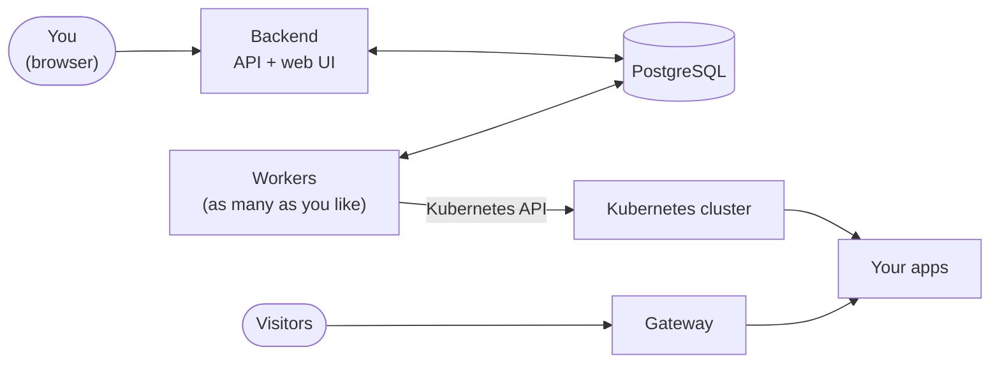

# Nimbus

**Draw your stack, deploy it to Kubernetes.**

Nimbus is a deployment platform for people who would rather draw an application than write Kubernetes manifests. You
sketch your containers as boxes on a canvas, draw arrows for "this needs that", and press **Deploy**. Nimbus works out the
order, runs each container on a Kubernetes cluster, and tells you when it is ready, with a public web address if you
asked for one.

## What you can do

- **Design visually.** Add containers on a canvas, set their image, port, replicas and environment, and connect them.
  Changes are saved as you go, and every saved version is kept so you can look back or restore.
- **Pick images from a catalog**, or type any image name. A curated list of about 80 well-known images (databases, caches,
  web servers, monitoring and more) fills in sensible defaults.
- **Deploy in the right order.** The arrows decide what starts first; containers that do not depend on each other start
  together. Watch progress per container, and cancel at any time.
- **Autoscale and go public.** Give a container a replica range and a CPU target, or mark it Public to get its own web
  address.
- **Import and export YAML**, so designs are easy to share and keep in version control.
- **Run it for a team.** Sign in with GitHub, keep apps private to their owner, and use the admin area to see every worker
  and member, tune workers while they run, and decide who is an admin.

## How it fits together



The backend never deploys anything itself. It writes **jobs** (one per container) to the database, and **workers** claim
them, deploy to the cluster, and report back. Workers can be added or lost at any time. The details, with diagrams, are in
[Architecture](docs/architecture.md).

## Quick start

You need Docker with Compose v2, and a GitHub OAuth App for sign-in (a minute to create, see
[Getting started](docs/getting-started.md#sign-in-setup-a-github-oauth-app)).

```bash
cd deploy
cp .env.example .env       # fill in the REQUIRED values
docker compose up -d
```

Open **http://localhost:8080** and sign in (then `scripts/promote-super-admin.sh <your-github-username>` makes you a super admin, to see the admin pages). That starts the database, Redis, the backend with the web application, and three
workers, from the published images. Out of the box the workers use a stand-in runner that deploys nothing, so you can try
everything without a cluster; to deploy for real, see [Running with Docker](docs/running-with-docker.md#deploying-to-a-real-cluster).

To try a ready-made app, import [`examples/hello-ui.yaml`](examples/hello-ui.yaml) from the dashboard.

## Documentation

| Read this | To learn |
|---|---|
| [Getting started](docs/getting-started.md) | System requirements, the GitHub sign-in setup, running with Docker or from source, the first admin, troubleshooting. |
| [Running with Docker](docs/running-with-docker.md) | The Compose stack in depth: settings, scaling workers, deploying to a cluster, upgrading, backups. |
| [Architecture](docs/architecture.md) | How it works: the pieces, the deployment lifecycle, leases and cancellation, workers, how containers run on Kubernetes, public access, roles, the data model. |
| [Configuration](docs/configuration.md) | Every setting of the backend and the worker. |

## Where things are

| Folder | What is in it |
|---|---|
| [`frontend/`](frontend) | The web application (React, TypeScript, Vite). |
| [`services/backend/`](services/backend) | The backend (Kotlin, Spring Boot): API, sign-in, designs, deployment planning, admin. |
| [`services/worker/`](services/worker) | The worker (Go): claims jobs and deploys containers. |
| [`deploy/`](deploy) | Docker Compose files and settings example for running the published images. |
| [`k8/`](k8) | Kubernetes and kind manifests: PostgreSQL and Redis, the public Gateway, the local dev cluster. |
| [`scripts/`](scripts) | `nimbus.sh` and `port-forward.sh` (PostgreSQL and Redis in a local cluster), `dev-cluster.sh` (the cluster that runs users' apps), `promote-super-admin.sh` (give someone the top role). |
| [`examples/`](examples) | Example designs to import. |
| [`docs/`](docs) | The documentation above. |
| [`.github/workflows/`](.github/workflows) | Builds, tests and publishes the backend and worker images. |

## Built with

| | |
|---|---|
| **Web application** | React 19, TypeScript, Vite, Tailwind CSS, TanStack Query, React Flow (the canvas). |
| **Backend** | Kotlin on Spring Boot 4 and JDK 25, Spring Security (GitHub OAuth), JPA, Flyway migrations. |
| **Worker** | Go, PostgreSQL via pgx, the official Kubernetes client. |
| **Data** | PostgreSQL 16 for everything that matters; Redis 7 (optional) for sign-in sessions. |
| **Cluster** | Any Kubernetes cluster; the Gateway API for public addresses (Envoy Gateway in the dev setup); kind for local development. |

## Status

Nimbus works end to end for **stateless containers**: design, version, deploy in order, autoscale, cancel, and give
containers public HTTP addresses. Not built yet: **stateful containers (volumes) and secret values**, cleaning up the
cluster when a design shrinks or an app is deleted, HTTPS for public addresses, and health monitoring after deployment.
The Kubernetes runner refuses designs that need an unfinished feature, with a clear message, rather than deploying them
half-configured. The full list is at the end of [Architecture](docs/architecture.md#limits-and-what-is-not-built-yet).
