# Architecture

How Nimbus is put together, and why. This document describes concepts and behaviour, not code. For how to run it, see
[Getting started](getting-started.md); for every setting, see [Configuration](configuration.md).

## Contents

- [The idea in one minute](#the-idea-in-one-minute)
- [System overview](#system-overview)
- [The pieces](#the-pieces)
- [The design of an app](#the-design-of-an-app)
- [Deploying: from a click to running containers](#deploying-from-a-click-to-running-containers)
- [Leases, heartbeats and cancellation](#leases-heartbeats-and-cancellation)
- [Workers](#workers)
- [How containers run on Kubernetes](#how-containers-run-on-kubernetes)
- [Public access](#public-access)
- [Accounts and roles](#accounts-and-roles)
- [The image catalog](#the-image-catalog)
- [The data model](#the-data-model)
- [The web application](#the-web-application)
- [Design decisions and trade-offs](#design-decisions-and-trade-offs)
- [Limits, and what is not built yet](#limits-and-what-is-not-built-yet)

## The idea in one minute

A person draws their application as boxes and arrows: each box is a **container** (an image, a port, a number of
replicas), and an arrow from A to B means "A needs B". Nimbus saves that picture as a versioned **design**. When the
person presses **Deploy**, Nimbus turns the design into one **job per container**, in an order that respects the
arrows, and a pool of **workers** carries the jobs out against a Kubernetes cluster.

Three ideas hold the system together:

1. **The database is the meeting point.** The backend and the workers never call each other. The backend writes jobs
   to PostgreSQL; workers claim them from PostgreSQL. This keeps both sides simple, lets workers be added or lost at
   any time, and makes every state change inspectable.
2. **Everything a job holds is a lease.** A worker that claims a job holds it only as long as it keeps proving it is
   alive. If it stops, the job is taken back and offered again.
3. **The cluster is described, not scripted.** Workers state what each container should look like and let Kubernetes
   make it so, which makes repeating a deployment safe.

## System overview

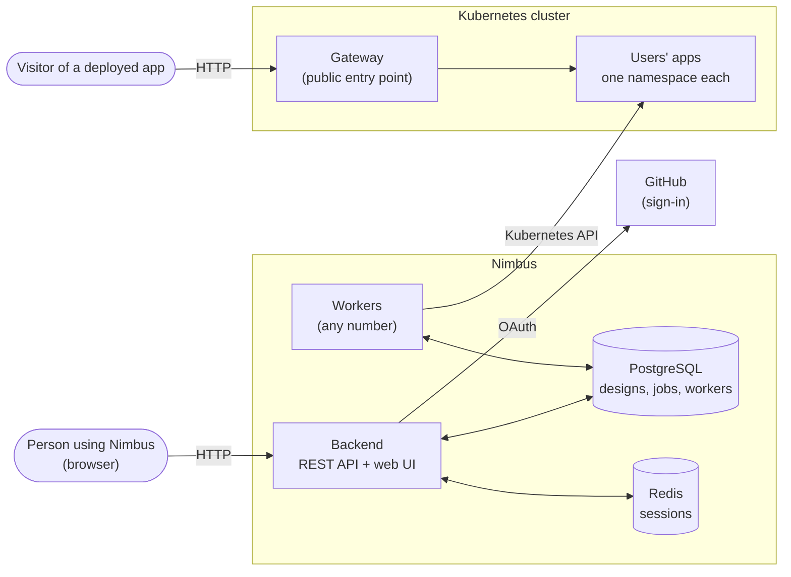

The backend serves both the REST API and the web application (the built web app is embedded in the backend, so there
is one thing to run and one address to open). Redis is optional: it only keeps sign-in sessions across restarts and
across several backend instances.

## The pieces

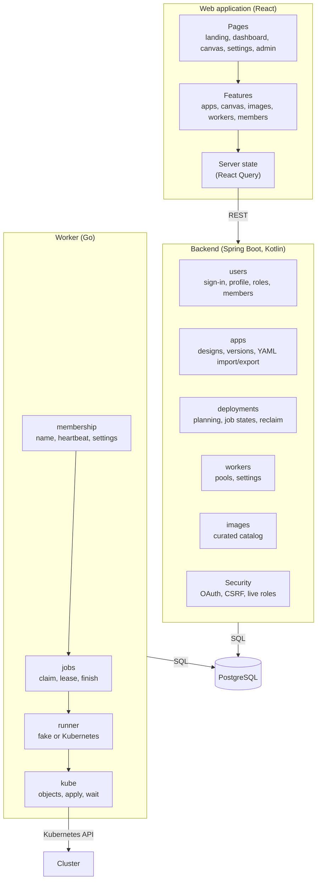

| Piece | Responsibility | Deliberately does **not** |
|---|---|---|
| **Web application** | Drawing designs, deploying, watching progress, administration. | Talk to the cluster or to workers. |
| **Backend** | Owns the database schema, sign-in, designs and versions, planning deployments into jobs, deciding when a deployment is finished, the admin APIs. | Deploy anything itself. |
| **Worker** | Registers itself, claims jobs, keeps their leases alive, deploys one container per job, reports the result. | Own the schema (it only reads and writes the tables the backend defines). |
| **PostgreSQL** | The single source of truth for everything above. | |
| **Redis** | Sign-in sessions. | Hold anything that matters if lost. |
| **Kubernetes** | Actually runs the containers. | |

## The design of an app

An app's design is a graph: **containers** (nodes) and **needs** (edges). It is stored as one document per version
rather than as many small rows, because it is always read and written whole.

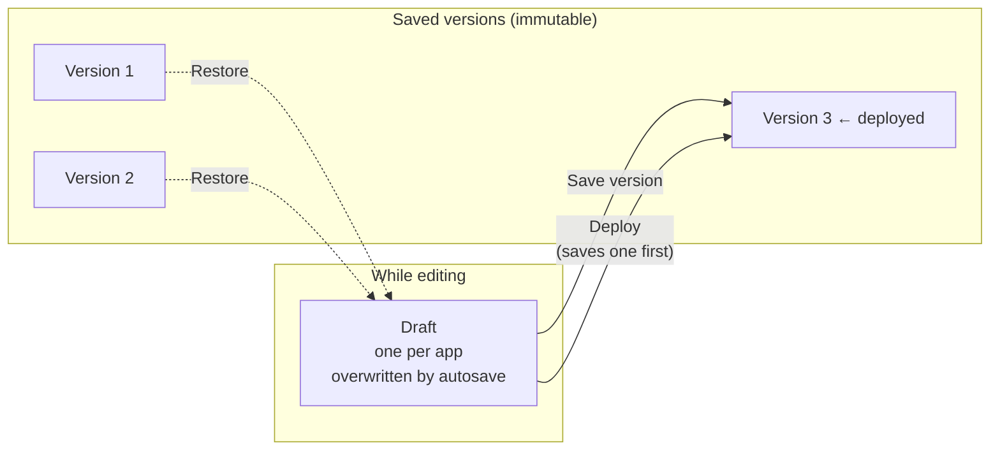

- **Autosave with a revision check.** Every edit carries the revision it was based on. If two tabs edit the same app,
  the second is told it is out of date instead of silently overwriting the first.
- **Versions are immutable.** A saved version never changes, so "what was deployed" can always be looked up and
  re-deployed. Saving an identical design twice does not create a second version.
- **Deploying pins a version.** Pressing Deploy first saves the current draft as a version, then deploys exactly that.
- **Validation is separate from saving.** An incomplete design can always be saved (so work is never lost), but it
  cannot be deployed: the editor lists what to fix (a missing image, a name clash, a dependency loop, a public
  container with no port, and so on).
- **YAML round trip.** A design can be exported to a small YAML file and imported again, which is also the easiest way
  to share one. An example is in [`examples/hello-ui.yaml`](../examples/hello-ui.yaml).

**What "needs" means.** An arrow from A to B says A needs B, so **B is deployed first**. Containers that do not depend on
each other deploy in parallel.

## Deploying: from a click to running containers

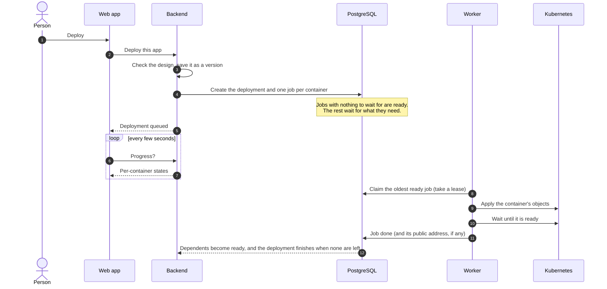

The planning step turns the graph into an ordered list of jobs. Each job knows which other jobs it waits for, so
claiming jobs in any order can never start a container before the things it needs. When a job succeeds, the jobs that
were waiting for it become ready. When the last job succeeds, the deployment succeeds and the app is **Running**.

### States

An app, a deployment and each job have their own small state machine. The deployment's state always follows from its
jobs, and is only ever set by one piece of logic, so the two cannot disagree.

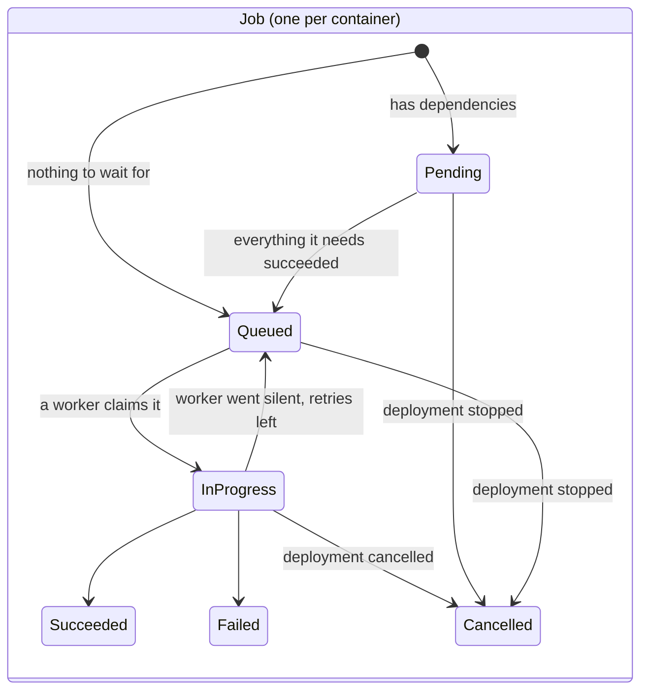

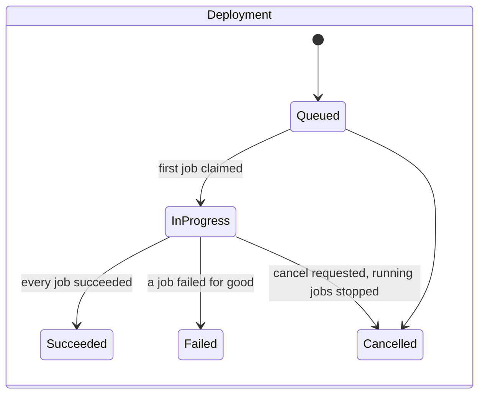

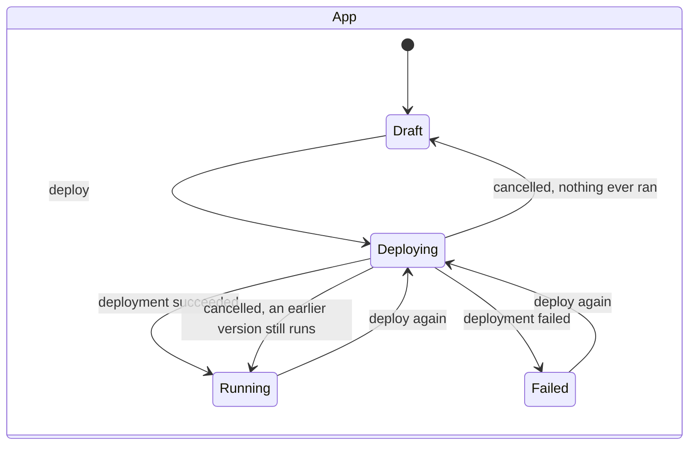

When one job fails for good, the rest of the deployment is **abandoned**: jobs that have not started are cancelled,
jobs that are running are told to stop at their next heartbeat, and the deployment ends as Failed once nothing is
running.

## Leases, heartbeats and cancellation

A worker that claims a job is given a **lease** with a fixed end time. While the job runs, the worker sends a
**heartbeat** every 30 seconds. The heartbeat does two things: it proves the worker is alive, and it asks whether the
deployment has been cancelled.

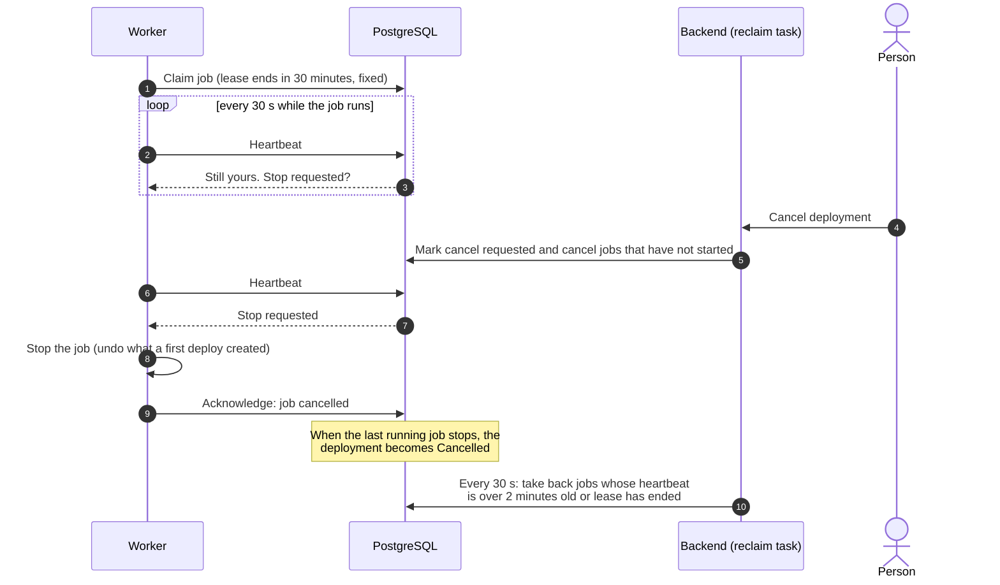

- **The lease end never moves.** Heartbeats keep the *worker* alive; they do not extend the lease. A job that runs
  longer than its lease is taken back, which bounds how long a stuck job can hold things up.
- **A silent worker loses its jobs.** A background task in the backend takes back any job whose heartbeat is more than
  two minutes old (or whose lease has ended). The job is queued again, up to a limit of attempts, after which it fails.
- **Cancellation is cooperative.** The backend only records the request; the worker holding the job stops it on its
  next heartbeat. Cancelling therefore takes up to 30 seconds to reach a running job. If the worker has died, the
  reclaim task finishes the cancellation instead.
- **Only the holder can finish a job.** Completing, failing or acknowledging a stop all check that the caller still
  holds the lease, so a worker that was cut off cannot overwrite what its replacement did.
- **What a stop may undo.** If a *user* cancels a first deploy, the worker removes what it had just created. If the
  stop came from a lost lease or a shutdown, it removes nothing, because another worker may be deploying the same
  container right now.

Locks are always taken in the same order (app, then deployment, then job) by the backend and by workers, so a user
cancelling at the same moment a worker finishes cannot deadlock.

## Workers

Workers are interchangeable and can be started or stopped at any time.

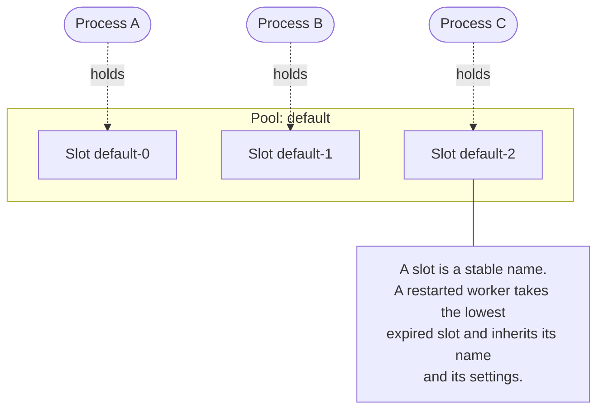

- **Names are stable, processes are not.** A worker holds a named **slot** (`default-0`, `default-1`, ...) for as long as
  it keeps renewing it (every 10 seconds, with a 30-second lease). When a process restarts it takes the lowest free
  slot, so a worker keeps the same name, and the same settings, across restarts. Jobs, however, are leased to the
  *process*, so a restarted worker never inherits another process's jobs.
- **Pools.** Workers are grouped into pools (by default there is one, `default`). Pools exist so that settings can be
  shared.
- **Settings can be changed while workers run.** Two settings are adjustable from the admin page: how many jobs a worker
  runs at once, and how long a job's lease is. Each applies in this order of precedence:

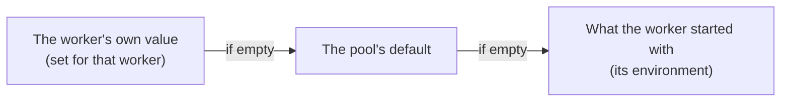

  Settings carry a version. A worker applies the stored settings only when the version changes, and reports back which
  version it has applied (or why it refused), so the admin page can show whether a worker has caught up.
- **A worker never runs more jobs than its limit.** The count is taken from the database (jobs leased to that worker
  that are in progress), not from a counter in the worker, so it cannot drift. Lowering the limit does not stop jobs
  already running.
- **A worker only claims while it is registered.** If it cannot confirm its slot (it was taken over, or the database
  has been unreachable for most of a lease), it claims nothing and tries to register again.

## How containers run on Kubernetes

The Kubernetes runner gives every app **its own namespace** and turns each container of the design into a small set of
standard objects.

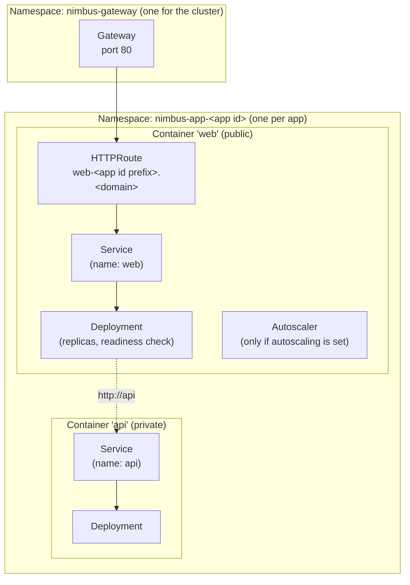

- **One namespace per app.** It isolates apps from each other, avoids name clashes between apps, and means deleting an
  app is deleting one namespace.
- **Containers find each other by name.** Each container with a port gets a Service named after it, so inside an app
  the container called `api` is reachable at `http://api`.
- **Applying is repeatable.** Objects are applied declaratively, so repeating a deployment changes nothing, and a
  changed design changes only what differs. A container's pods are not restarted just because a new deployment was
  made.
- **A container is "ready" only when it really is.** For a container with a port, ready means the port accepts
  connections. Every container must also stay up for a few seconds, so one that starts and immediately crashes (or has
  no port to check) is not mistaken for working.
- **Failures say why.** The worker watches the pods while waiting and fails the job with the actual reason: the image
  could not be pulled, the container keeps crashing (with its last output), or no node has room.
- **Autoscaling owns the replica count.** When a container has autoscaling, its replica count is left to the
  autoscaler, so redeploying never fights it.
- **Safety defaults.** App pods receive no Kubernetes API credentials, and the worker only ever talks to the cluster
  named in its settings (it refuses to fall back to "whatever the current kubectl context is").

### Choosing a runner

| Runner | What it does | Use it for |
|---|---|---|
| `fake` (default) | Waits a few seconds and reports success. Deploys nothing. | Trying the UI and the job flow without a cluster. |
| `kubernetes` | Deploys to a cluster as described above. | Real use. |

## Public access

A container marked **Public** gets a web address of the form `http://<container>-<first 8 characters of the app id>.<base domain>`.
Nimbus uses the Kubernetes **Gateway API**: the cluster has one shared Gateway, and each public container adds a route
in its own namespace that sends its hostname to the container's Service.

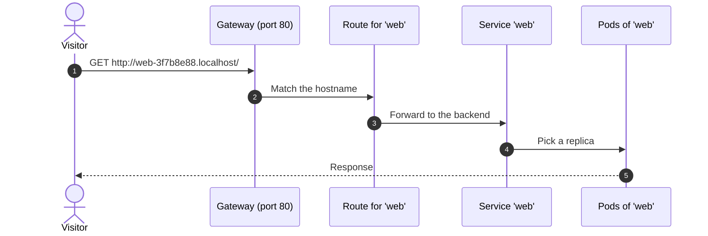

- **Only Nimbus-managed namespaces may attach routes** to the Gateway, so nobody else can publish through it.
- **The controller is replaceable.** Nimbus only creates standard Gateway API objects, so any conforming controller can
  serve the Gateway. The development setup uses Envoy Gateway.
- **The worker waits for the Gateway to accept the route** and records the final address on the job; the UI then shows
  the address. It is listed in plain sight: in a "Live at" bar on the app's page, under the container's Public switch, and on the app's card on the dashboard. Turning Public off and redeploying removes the route.
- **It is public on purpose.** Turning Public on asks for confirmation, because there is no sign-in in front of a public
  container. Only web traffic is supported (not databases or other protocols), and only plain HTTP for now.
- **Names.** Because the address is built from the container's name, a public container's name is limited to 54
  characters.

## Accounts and roles

People sign in with GitHub. The first sign-in creates an account; no passwords are stored. After signing in, a person
completes a short profile once, then lands on their dashboard.

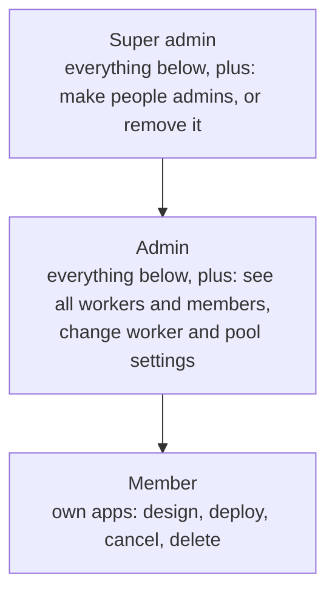

- **Each role includes the ones below it.**
- **Apps are private to their owner.** A person only ever sees and changes their own apps.
- **A super admin is created only in the database.** No request can create one or take one away, and nobody can change
  their own role, so the last person able to manage roles cannot lock themselves out. See
  [Getting started](getting-started.md#the-first-super-admin) for how to make the first one.
- **Role changes apply immediately.** The role is read from the database on every request rather than copied into the
  sign-in session, so taking admin away stops working at once, even for someone who is signed in.
- **Safeguards on the API.** Modifying requests carry a CSRF token; the admin APIs are closed to everyone without the
  admin role.

## The image catalog

When choosing an image for a container, people can type any image name, or pick from a **curated catalog** of about 80
well-known images (web servers, databases, caches, message brokers, search, monitoring, developer tools and more).
Picking one fills in the port, whether it is stateful, its volume and the environment variables it needs.

- The catalog is a single file in the backend, checked at startup: a mistake in it stops the application from starting
  instead of reaching users.
- The web app fetches it once and searches it locally, so typing stays instant. If it cannot be loaded, the image
  field still works as a plain text box.
- It only lists images that start on their own with their default command, since a container has no command of its own.
- Picking an image never overwrites choices the person already made, apart from the image itself.

## The data model

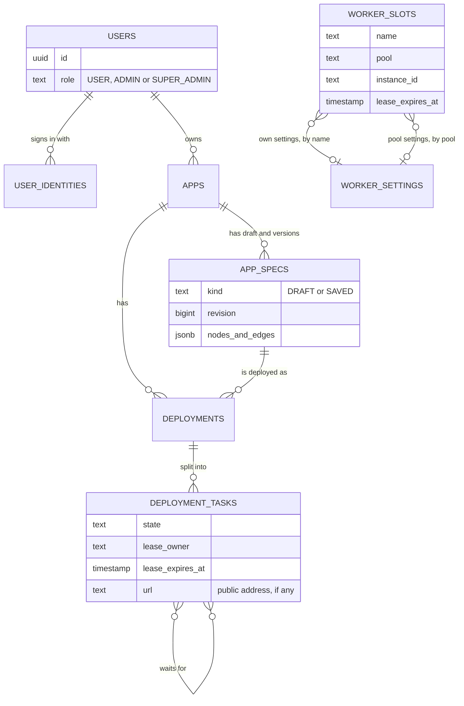

| Table | Holds |
|---|---|
| `users`, `user_identities` | Accounts and how each signs in (GitHub), with the role. |
| `apps` | One row per app: name, owner, current state. |
| `app_specs` | The design: one mutable draft per app and immutable saved versions. |
| `deployments` | A request to deploy one saved version, with its state and cancel/abort flags. |
| `deployment_tasks` | The jobs: one per container, with dependencies, state, lease and the public address. |
| `worker_slots` | Registered workers: name, pool, current process, slot lease, applied settings version. |
| `worker_settings` | Settings per pool and per worker, each with a version for change detection. |

Schema changes are versioned migrations owned and run by the backend, and the backend refuses to start if the database
does not match what it expects. Workers use the schema but never change it.

## The web application

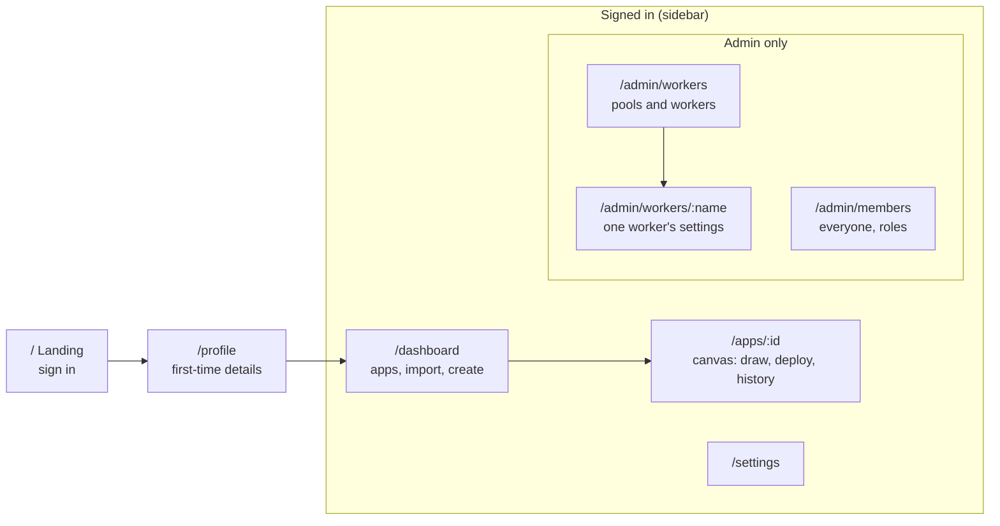

- **One server-state layer.** Lists and details are fetched and cached by React Query. Polling runs only while it is
  needed (a deployment is running, or the workers page is open).
- **The canvas owns the design once loaded.** It autosaves quietly and never refetches the design underneath the person
  editing it. While a deployment is queued or running the design is locked, so what is deployed cannot change under it.
- **Light and dark themes**, a collapsible sidebar, and layouts that work on a phone.
- **Production vs development.** In production the backend serves the built web app itself. In development the web app
  runs on its own dev server and proxies API calls to the backend, so there is still one address from the browser's
  point of view.

## Design decisions and trade-offs

| Decision | Why | What it costs |
|---|---|---|
| **Workers talk to the database, not to the backend** | No second protocol to secure or version; trivial to add or lose workers; every state change is inspectable and testable. | Workers need database credentials, so they belong inside your trust boundary. |
| **Per-job leases with a fixed end** | A stuck job can hold things up only for a bounded time, and heartbeats stay cheap. | A job that legitimately runs past its lease is taken back. |
| **Cooperative cancellation** | The only safe way to stop work that is already running on someone else's cluster. | Cancel takes up to one heartbeat (30 s) to reach a running job. |
| **The design is a single versioned document** | It is always read and written whole; history and restore are trivial. | Cross-app queries over containers would need an index later. |
| **One namespace per app** | Isolation and one-step cleanup. | The worker needs permission to create namespaces. |
| **Gateway API, not Ingress** | The Kubernetes project retired the most common Ingress controller in 2026 and recommends the Gateway API. | Needs a Gateway controller installed in the cluster. |
| **Roles read from the database on each request** | Promotions and demotions take effect immediately. | One small query per request. |
| **A super admin is made in the database only** | No API can escalate privileges. | The first one needs a one-line database change. |
| **Redis is optional** | Fewer moving parts for a single-instance setup. | Without it, sessions end when the backend restarts. |

## Limits, and what is not built yet

**Limits.** Each person can have up to 50 apps, and a design can have up to 100 containers. An app keeps its 50 most recent saved versions; older ones are removed, except any that were deployed (so "what was deployed" can still be looked up).

**Built today:** sign-in and roles, the drawing canvas with autosave, versions, YAML import and export, the image
catalog, deployments with ordering, cancellation, leases and reclaim, the worker registry and admin pages, member
management, deploying stateless containers to Kubernetes, autoscaling, and public HTTP addresses.

**Not built yet** (the design leaves room for each):

- **Secret values**, and **stateful containers with more than one replica**, volume resizing and backups: the Kubernetes
  runner refuses designs that use them, with a clear message, instead of deploying them half-configured. A stateful
  container runs as a single pod with a volume that is kept when the container is removed or its deployment cancelled.
- **Cleaning up on redeploy and delete**: containers removed from a design are not yet removed from the cluster, and
  deleting an app does not yet delete its namespace.
- **HTTPS** for public containers (certificates).
- **Health after deployment**: an app is Running once deployed; a later failure is not yet noticed (the Degraded state
  exists but nothing sets it).
- **Retrying a failed job**: a failure is final; only jobs whose worker went silent are retried.
- **Authentication on a worker's own settings endpoint**: keep workers' HTTP ports off the public network.
- **Volume backups to object storage**, **private registry credentials**, and **multiple clusters**.
