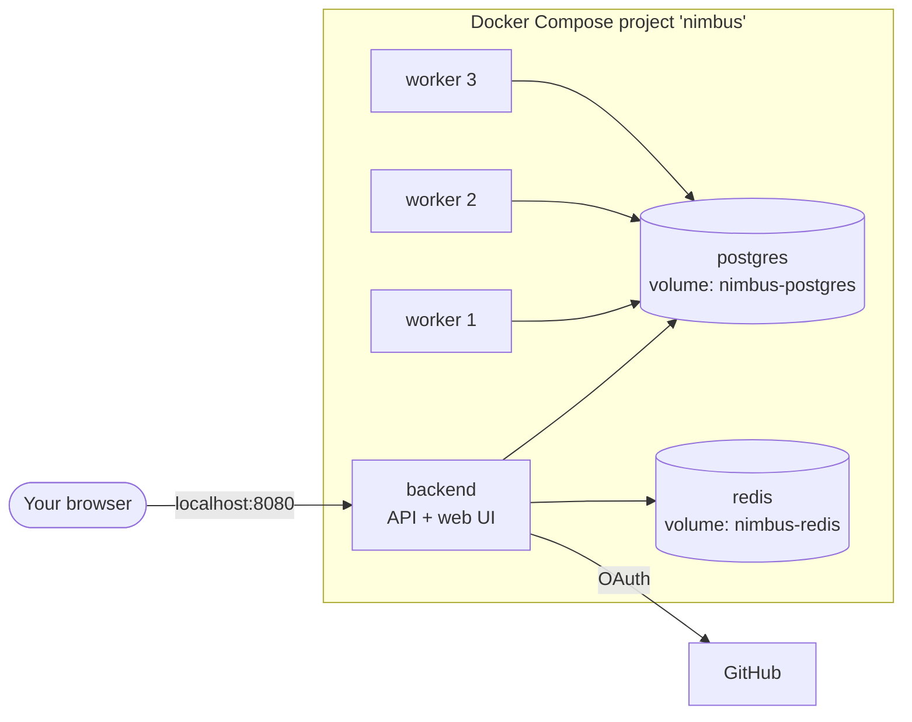

# Running with Docker

How to run Nimbus from its published images with Docker Compose. The files are in [`deploy/`](../deploy):

| File | Purpose |
|---|---|
| `docker-compose.yml` | The stack: PostgreSQL, Redis, the backend (with the web application) and three workers. |
| `docker-compose.kubernetes.yml` | An optional add-on that makes the workers deploy to a real Kubernetes cluster. |
| `.env.example` | Every setting, with comments. Copy it to `.env`. |

New to Nimbus? Read [Getting started](getting-started.md) first: it covers the requirements and the GitHub sign-in setup
that this stack needs.

## What runs



- **Only the backend is published** to your machine (port 8080 by default). The database, Redis and the workers are
  reachable only by the other containers, so no database port is exposed.
- **Start order is handled for you.** The backend waits for the database and Redis to be healthy. The workers wait for the
  backend, because the backend creates the database tables.
- **Your data lives in two Docker volumes** (`nimbus-postgres` and `nimbus-redis`), so it survives restarts and upgrades.

## Quick start

```bash
cd deploy
cp .env.example .env     # fill in the REQUIRED values
docker compose up -d
docker compose ps        # wait until the backend shows "healthy"
```

Then open http://localhost:8080, sign in, and run `scripts/promote-super-admin.sh YOUR-GITHUB-USERNAME` from the repository root to
[make yourself a super admin](getting-started.md#the-first-super-admin) and see the admin pages.

## Settings

All settings live in `deploy/.env`. The ones you must provide:

| Setting | What |
|---|---|
| `DOCKERHUB_USERNAME` | The Docker Hub account the `nimbus-backend` and `nimbus-worker` images are published under. (Or set `BACKEND_IMAGE` and `WORKER_IMAGE` to name the images in full, for a private registry or locally built images.) |
| `POSTGRES_PASSWORD` | A password of your choice for the database. It is only used between containers. |
| `GITHUB_CLIENT_ID`, `GITHUB_CLIENT_SECRET` | From your GitHub OAuth App (see [Getting started](getting-started.md#sign-in-setup-a-github-oauth-app)). |

Useful options:

| Setting | Default | What |
|---|---|---|
| `NIMBUS_TAG` | `latest` | Which image version to run: `latest`, a release like `v0.1.0`, or a commit tag. Pin a version for anything you care about. |
| `BACKEND_PORT` | `8080` | The port on your machine. If you change it, change the callback URL of your GitHub OAuth App to match. |
| `WORKER_REPLICAS` | `3` | How many workers to run. |
| `WORKER_PARALLEL_JOBS` | `4` | How many jobs each worker runs at once. |
| `WORKER_POOL` | `default` | The pool the workers belong to. |
| `WORKER_RUNNER` | `fake` | `fake` deploys nothing; `kubernetes` deploys to a cluster (see below). |

Every other worker and backend setting is described in [Configuration](configuration.md).

## Using your own images

The published images are built by GitHub Actions (`.github/workflows/backend-image.yml` and `worker-image.yml`), which publish to
Docker Hub as `<account>/nimbus-backend` and `<account>/nimbus-worker`, tagged with the short commit, with `latest` for the
main branch and with the release tag for version tags.

To run images you built yourself, point the two image settings at them:

```bash
# build the backend jar (it embeds the web application), then the images
cd frontend && npm ci && npm run build && cd ..
cd services/backend && ./gradlew bootJar && docker build -t my/nimbus-backend:dev . && cd ../..
docker build -t my/nimbus-worker:dev services/worker
```

and in `deploy/.env`:

```bash
BACKEND_IMAGE=my/nimbus-backend:dev
WORKER_IMAGE=my/nimbus-worker:dev
```

## Scaling workers

Workers are interchangeable. Change how many are running without restarting anything else:

```bash
docker compose up -d --scale worker=5
```

or set `WORKER_REPLICAS` in `.env`. New workers take the next free names (`default-3`, `default-4`, ...); removed ones free
theirs after a few seconds. The **Workers** page in the admin area shows them all, and lets a super admin or admin change each
worker's (or the whole pool's) parallel-jobs and lease settings while they run.

## Deploying to a real cluster

By default the workers use the stand-in runner: a deployment "succeeds" after a few seconds, but nothing runs. To make
them deploy to Kubernetes, add the second Compose file and give the workers a kubeconfig they can use **from inside a
container**.

1. **Have a cluster.** For local development, `scripts/dev-cluster.sh up` creates a kind cluster named `nimbus-dev` with the
   Gateway installed.
2. **Write a kubeconfig the containers can use.** A cluster's normal kubeconfig points at an address that only works on your
   machine (for kind, `127.0.0.1`). For a kind cluster, export the *internal* one, which uses the cluster's name on Docker's
   network, and make it readable:

   ```bash
   kind get kubeconfig --name nimbus-dev --internal > /path/to/nimbus-kubeconfig
   chmod 644 /path/to/nimbus-kubeconfig
   ```

3. **Add to `deploy/.env`:**

   ```bash
   KUBECONFIG_FILE=/path/to/nimbus-kubeconfig
   KUBE_CONTEXT=kind-nimbus-dev
   WORKER_BASE_DOMAIN=localhost
   WORKER_GATEWAY=nimbus-gateway/nimbus
   ```

   The domain and Gateway are only needed for public containers.
4. **Start with both files:**

   ```bash
   docker compose -f docker-compose.yml -f docker-compose.kubernetes.yml up -d
   ```

   Each worker logs the cluster it connected to when it starts (`docker compose logs worker`). They join the `kind`
   Docker network so they can reach a kind cluster's API server.

Notes:

- **The context is always named.** The workers deploy only to `KUBE_CONTEXT`. They will not fall back to whichever context
  happens to be current.
- **A kubeconfig is a credential.** Whoever can read it controls that cluster. It is mounted read-only into the workers
  and nowhere else.
- **For a cluster that is not kind,** produce a kubeconfig whose server address is reachable from the worker containers
  (and drop the `kind` network from the override file if you have no such network). Running the workers *inside* the target
  cluster, with their own service account, is the better setup for production, and is what `WORKER_KUBE_IN_CLUSTER` is for.

## Everyday commands

| Task | Command (from `deploy/`) |
|---|---|
| See what is running | `docker compose ps` |
| Follow the logs | `docker compose logs -f backend` (or `worker`, `postgres`) |
| Stop, keeping data | `docker compose down` |
| Stop and delete all data | `docker compose down -v` (this removes the database) |
| Restart one part | `docker compose restart backend` |
| Open a database prompt | `docker compose exec postgres psql -U nimbus -d nimbus` |

## Upgrading

```bash
docker compose pull
docker compose up -d
```

The backend upgrades the database tables itself when it starts, and refuses to run if they do not match what it expects.
To go back, set `NIMBUS_TAG` to the previous version and `up -d` again (database upgrades are not undone, so back up first
if you may need to go back).

## Backing up

Everything that matters is in PostgreSQL (Redis only holds sign-in sessions). To take a copy:

```bash
docker compose exec -T postgres pg_dump -U nimbus nimbus > nimbus-backup.sql
```

and to restore into a fresh stack, start only the database, then load the file:

```bash
docker compose up -d postgres
docker compose exec -T postgres psql -U nimbus -d nimbus < nimbus-backup.sql
```

## Running behind a domain

For anything beyond your own machine, put Nimbus behind a reverse proxy that terminates HTTPS and forwards to the backend
port. The backend honours the usual forwarded-host headers, so sign-in redirects use your public address. Then:

- set your GitHub OAuth App's callback URL to `https://<your domain>/login/oauth2/code/github`;
- keep the database, Redis and the workers' HTTP ports off the public network (a worker's settings endpoint has no
  authentication of its own).

## Troubleshooting

| Symptom | Cause and fix |
|---|---|
| `required variable ... is missing a value` | A REQUIRED value in `.env` is empty; the message names it. |
| Backend stays "unhealthy" | `docker compose logs backend`. Usually a missing `GITHUB_*` value or a wrong database password (if you changed the password after the database was first created, the old one is kept in the volume: `docker compose down -v` resets it, deleting data). |
| Workers keep restarting | They wait for the backend; check the backend is healthy first, then `docker compose logs worker`. |
| Workers log "set WORKER_KUBE_CONTEXT" | You used the Kubernetes file without setting `KUBE_CONTEXT` in `.env`. |
| Workers cannot reach the cluster | The kubeconfig's server address is not reachable from inside a container. For kind, use the `--internal` kubeconfig and make sure the `kind` network exists (`docker network ls`). |
| Port already allocated | Something else uses the backend port. Set `BACKEND_PORT` to a free one (and update the GitHub callback URL). |
